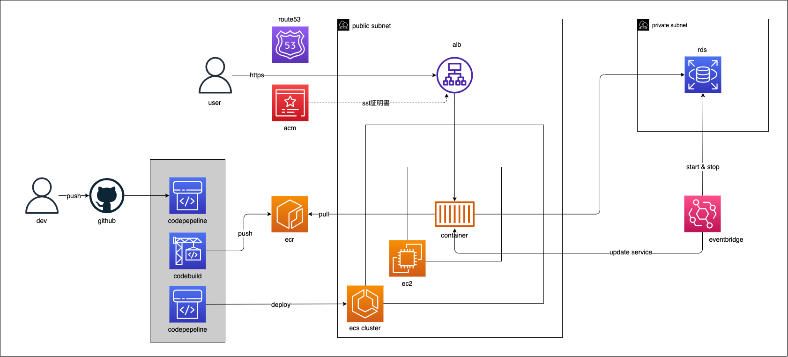

## アプリケーション概要

このアプリケーションは、Django REST Framework (DRF) のチュートリアル に沿って構築された スニペット管理機能 を実装したものです。

フロントエンド (FE) は Next.js で実装しています。

認証方法は、JWT 認証を実装しています。

## url

https://drf-jwt-tutorial-fe.vercel.app/snippets

※ aws コストを考慮して、バックエンドは 8-20 時の間のみ稼働

## 作成背景

課題に感じているバックエンドのフレームワーク (Django REST Framework) への理解を深めることを目的に、DRF の公式チュートリアル に沿って構築しました。

- バックエンドの理解を強化するため に、REST API の基本から学習。
- フロントエンド (Next.js) を組み合わせ、実務に近い構成を意識。
- インフラ環境は AWS を採用 し、実際の開発に近い運用を意識。

## 技術スタック・開発環境

### [フロントエンド](https://github.com/goayasushi/drf_jwt_tutorial_fe)

- Next.js
- Chakra UI
- react icons
- react-syntax-highlighter
- React Hook Form
- axios
- TanStack Query
- jwt-decode

### [バックエンド](https://github.com/goayasushi/drf_jwt_tutorial_be)

- Django
- Django REST Framework
- djangorestframework-simplejwt
- django-cors-headers
- psycopg2-binary
- PostgreSQL
- Gunicorn

### インフラ

- フロントエンド: vercel

- バックエンド: AWS
  - Route53
  - ACM
  - ALB
  - ECS on EC2
  - ECR
  - RDS (PostgreSQL)
  - Eventbridge
  - codepipeline
  - codebuild

## CI/CD

### GitHub Actions による自動テスト

master ブランチへのプルリクエスト作成時に、テストのワークフローがトリガーされます。

### CodePipeline / CodeBuild による自動デプロイ

master ブランチへの push をトリガーに、CodeBuild で Docker イメージのビルド・ECR へのプッシュ、ECS on EC2 へのデプロイを実行します。

## aws システム構成図



## ローカル起動

docker 起動を前提として記載

- 環境変数の設定

  .env ファイルを作成し、任意の設定値を記述

  ```
  DATABASE_NAME=データベース名
  DATABASE_USER=ユーザー名
  DATABASE_PASSWORD=ユーザーで接続する際のパスワード
  DATABASE_HOST=ホスト名
  DATABASE_PORT=ポート番号
  ALLOWED_HOSTS=許可するホスト名
  CORS_ALLOWED_ORIGINS=CORS を許可するオリジン
  ```

- 起動

```
docker compose up --build -d
```

- リクエスト

  任意のクライアントツールからリクエストを実行

  - postman でユーザー登録リクエストを行う例
    - メソッド: `POST`
    - URL: `http://localhost:8000/account/register/`
    - リクエストボディ
      ```
      {
          "username": "test-user",
          "password": "test",
          "first_name": "テスト",
          "last_name": "登録",
          "email": "register@test.com"
      }
      ```

## 備忘録

インフラ構築・公開にあたり、詰まった箇所を備忘録として記載

### ecs 関連のエラー

- ec2 を private サブネットに配置した場合に、ec2 インスタンスの登録がされない

  インターネット接続が必要と思われる

  https://dev.classmethod.jp/articles/privatesubnet_ecs/

  `/var/log/ecs/ecs-agent.log`

  ```
  evel=info time=2025-02-11T01:21:31Z msg="Loading state!" module=state_manager.go
  level=info time=2025-02-11T01:21:31Z msg="Event stream ContainerChange start listening..." module=eventstream.go
  level=info time=2025-02-11T01:21:31Z msg="eni watcher has been initialized" module=watcher_linux.go
  level=info time=2025-02-11T01:21:31Z msg="Successfully got ECS instance credentials from provider: EC2RoleProvider"
  level=info time=2025-02-11T01:21:31Z msg="Successfully loaded Appnet agent container tarball: /managed-agents/serviceconnect/ecs-service-connect-agent.interface-v1.tar" image="ecs-service-connect-agent:interface-v1"
  level=info time=2025-02-11T01:21:31Z msg="Registering Instance with ECS"
  level=info time=2025-02-11T01:21:31Z msg="Remaining memory" remainingMemory=952
  level=error time=2025-02-11T01:22:01Z msg="health check [HEAD http://localhost:51678/v1/metadata] failed with error: Head \"http://localhost:51678/v1/metadata\": dial tcp 127.0.0.1:51678: connect: connection refused" module=healthcheck.go
  level=error time=2025-02-11T01:22:31Z msg="health check [HEAD http://localhost:51678/v1/metadata] failed with error: Head \"http://localhost:51678/v1/metadata\": dial tcp 127.0.0.1:51678: connect: connection refused" module=healthcheck.go
  level=error time=2025-02-11T01:23:01Z msg="health check [HEAD http://localhost:51678/v1/metadata] failed with error: Head \"http://localhost:51678/v1/metadata\": dial tcp 127.0.0.1:51678: connect: connection refused" module=healthcheck.go
  level=error time=2025-02-11T01:23:31Z msg="health check [HEAD http://localhost:51678/v1/metadata] failed with error: Head \"http://localhost:51678/v1/metadata\": dial tcp 127.0.0.1:51678: connect: connection refused" module=healthcheck.go
  level=error time=2025-02-11T01:23:32Z msg="Unable to register as a container instance with ECS" error="RequestError: send request failed\ncaused by: Post \"https://ecs.ap-northeast-1.amazonaws.com/\": dial tcp 52.195.202.50:443: i/o timeout"
  level=error time=2025-02-11T01:23:32Z msg="Error registering container instance" error="RequestError: send request failed\ncaused by: Post \"https://ecs.ap-northeast-1.amazonaws.com/\": dial tcp 52.195.202.50:443: i/o timeout"
  ```

  ->natgateway / vpc エンドポイントの設置でインターネット接続設定したいところだが、料金がかかるので ec2 を public サブネットに配置することにする

  _セキュリティを考慮して sg の設定は最小限にする_

- awsvpc モードでコンテナに接続できない

  https://zenn.dev/neko_student/articles/258cbed688e469
  https://qiita.com/k2-hara/items/bb2ebb3bc5efc3000729#4-2-%E3%82%B3%E3%83%B3%E3%83%86%E3%83%8A%E3%81%AB%E3%82%A2%E3%82%AF%E3%82%BB%E3%82%B9%E3%81%A7%E3%81%8D%E3%81%AA%E3%81%84%E5%95%8F%E9%A1%8C

  ->今回は、bridge モードで対応する。

### drf エラー

- 400bad request になる

  ALLOWED_HOSTS に追加が必要

  開発時は、settings. py の DEBUG が True かつ ALLOWED＿HOSTS が空だったため、localhost、127.0.0.1、[::1]]が自動的に有効になっていたため、400 にならなかったと思われる。

  https://office54.net/python/django/settings-allowed-hosts

  ```
  ALLOWED_HOSTS = ["リクエスト時のホスト"]
  ```

### alb 関連のエラー

- alb ヘルスチェックで ALLOWED_HOSTS のエラーが発生

  https://www.utakata.work/entry/2021/03/24/114349

  https://progl.hatenablog.com/entry/2018/02/12/022426

  -> ec2 ip を動的に取得し、ALLOWED_HOSTS に追加

  https://docs.aws.amazon.com/ja_jp/AWSEC2/latest/UserGuide/instancedata-data-retrieval.html

### codepipeline 関連のエラー

- codebuild authorization エラー

  ```
  authorization failed for primary source and source version xxxxxxx
  ```

  UseConnection のアクセス許可が必要

  https://rinoguchi.net/2021/08/aws-fullstack-sample-application-part3.html

- codebuild Too Many Requests エラー

  Image のダウンロード回数制限が原因と思われる

  -> AWS ECR Public からイメージを取得する

  https://dev.classmethod.jp/articles/codebuild-has-to-use-dockerhub-login-to-avoid-ip-gacha/

  https://zenn.dev/saba_can00/articles/aws-codebuild-too-many-request
